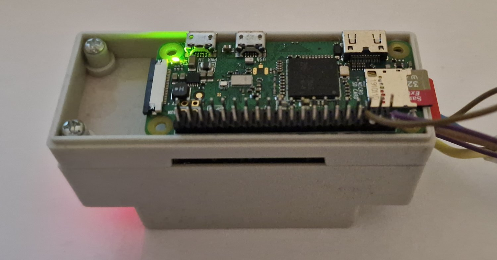

# rpi-random-number

## Raspberry Pi

Instructions on how to download and set up the kernel module build environment.

Set up build tools and create the kernel module.

The module will be created, built, and installed on the Raspberry Pi device.

Bonus:

 - Compile the latest kernel on the native device.
 - Cross-compile the kernel on another machine.

### Prepare and build kernel module

 - Prepare the Development Environment.
 - Write the Random Number Generator kernel module.
 - Set up a new character device.
 - Cross-compile and deploy the kernel module.

[Random Kernel Module - Prepare and Deploy](Random_module.md)

### Cross compile the Kernel

Instructions and examples on how to set up the environment for building the kernel on a local and another machine (Ubuntu host). Transfer the built kernel to the Raspberry Pi device.

 - [Compile the Latest Kernel on Native Device](Kernel_compile_rpi.md)
 - [Cross Compile the Latest Kernel on Another Machine](Kernel_cross_compile.md)

## Raspberry Pi API

Write a simple API that serves data from the kernel device built and deployed in the previous example.

### random_module API

[Simple GO API](Random_module-api.md)

### API example

Current API and kernel module is active on real-life Raspberry Pi Zero trough: 
http://randomnumber.dataio.cloud/number

