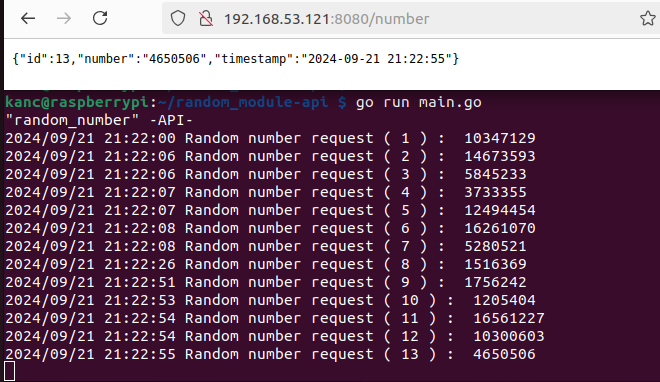

# API random_module

Create simple API with Golang.

Api will take all GET requests and serve JSON response with "random number" as primary result.

## Prepare directory

```bash
$ mkdir random_module-api
$ cd random_module-api
```

```bash
$ sudo apt update
$ sudo apt install golang
$ go version
// `go version go1.15.15 linux/arm`
```

## GO API

### Prepare API

initialize new go module.

I won't reinvent the wheel, so i will need go module in wich we will handle our application dependencies.

I will use `github.com/julienschmidt/httprouter` for simple http routes.

```bash
$ go mod init random_module/api-service
```
### Golang APP

[random_module-api/main.go](random_module-api/main.go)

 - To read from our `random_module` kernel module simple `os.Open` will be used.

```go
// Try to open random module device output.
file, err := os.Open("/dev/randommodule")
if err != nil {
  fmt.Println(err)
  return
}
```

 - After we read first line, file is closed.

```go
// Read single line from random module output.
scanner := bufio.NewScanner(file)
scanner.Scan()
buffer := scanner.Text()

file.Close()
```

### API basic response




 


