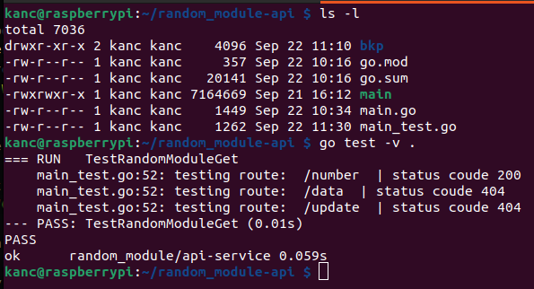

# API random_module

Create a simple API with Golang.

The API will handle all GET requests and serve a JSON response containing a "random number" as the primary result.

## Prepare directory

```bash
$ mkdir random_module-api
$ cd random_module-api
```

```bash
$ sudo apt update
$ sudo apt install golang
$ go version
// `go version go1.15.15 linux/arm`
```

## GO API

### Prepare API

initialize new go module.

Initialize new go module in which i will handle application dependencies.

I will use `github.com/julienschmidt/httprouter` for simple HTTP routes.

```bash
$ go mod init random_module/api-service
```
### Golang APP

[random_module-api/main.go](random_module-api/main.go)

 - To read from our `random_module` kernel module, we will use basic `os.Open`.

```go
// Try to open random module device output.
file, err := os.Open("/dev/randommodule")
if err != nil {
  fmt.Println(err)
  return
}
```

 - After we read first line, the file is closed.

```go
// Read single line from random module output.
scanner := bufio.NewScanner(file)
scanner.Scan()
buffer := scanner.Text()

file.Close()
```

### API basic response


 ## API Implement test

To implement a test for this simple API, I will use a different library from our main server library intentionally:
`github.com/gofiber/fiber/v2`

In Go, tests are implemented by creating a testing version of a script with the "_test" suffix.

  - The script `main_test.go` is created.




## Reflections

### GOlang version

Official repositories do not offer the latest Golang version needed to install known libraries. To install one of the latest versions of Golang, you need to compile it yourself.

 - get latest arm32 version

 ```bash
 /golang-v1.22.7 $ wget https://go.dev/dl/go1.22.7.linux-armv6l.tar.gz
 ```
 - Unpack current version

```bash
sudo tar -C /usr/local -xzf go1.22.7.linux-armv6l.tar.gz
```

 - Add unpacked version to PATH

 ```bash
 export PATH="/usr/local/go/bin:$PATH"
 ```


