# Random module

## Kernel module

The simplest way to start developing Raspberry Pi kernel modules is by installing raspberrypi-kernel-headers.

(An alternative is to download or clone the latest kernel package and point the compiler to that path.)

### Prepare Development Environment

Using the `raspberrypi-kernel-headers`:

```bash
$ sudo apt install raspberrypi-kernel-headers
```

Check current kernel module directory:
```bash
$ uname -a
$ uname -r
$ ls /lib/modules/6.1.21+/
$ ls /lib/modules/6.1.21+/build/
```
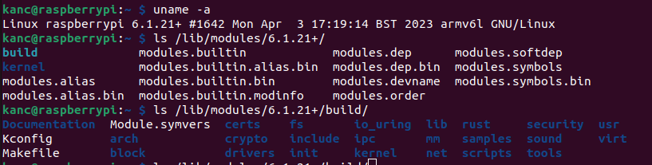

### Write a Simple Kernel Module

```bash
$ mkdir random_module
$ cd random_module/
$ nano random_module.c

```
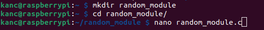

Test the kernel module by outputting some messages to systemd.

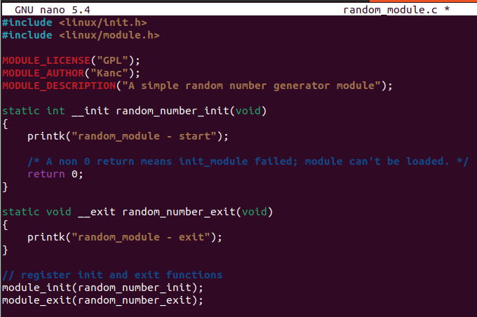

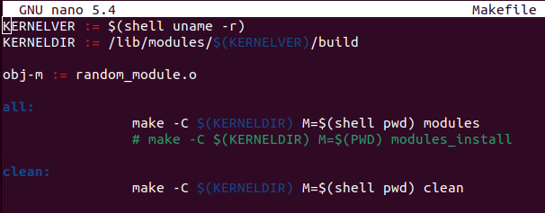

----
When both the module and the Makefile are prepared, run `make`.

```bash
$ make
```

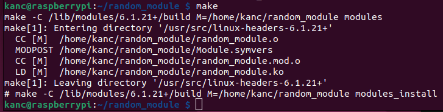

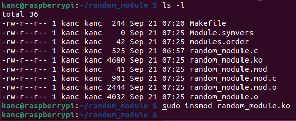

Modules are added to the kernel using the `insmod` command,
modules are removed from the kernel using `rmmod` command.

```bash
$ sudo insmod random_module.ko
$ sudo rmmod random_module.ko
```

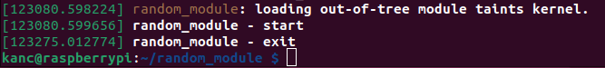

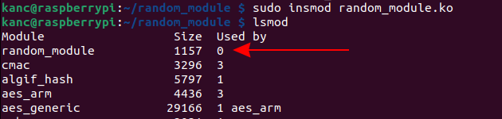


### Write Random Number Generator

Write a simple pseudo-random number generator and add this module to the kernel. 
This random generator will be created as a character device.

  - The Folder [random_modulde](random_module) contains both the `Makefile` and `random_module.c` file.
  - Make the random_module kernel module and add it to the kernel using `insmod`.
  - Add new characer device using `mknod`

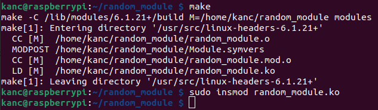  

### Character device

```bash
sudo mknod randommodule c 239 0
```

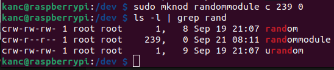

#### Get output

```bash
$ cat /dev/randommodule
```

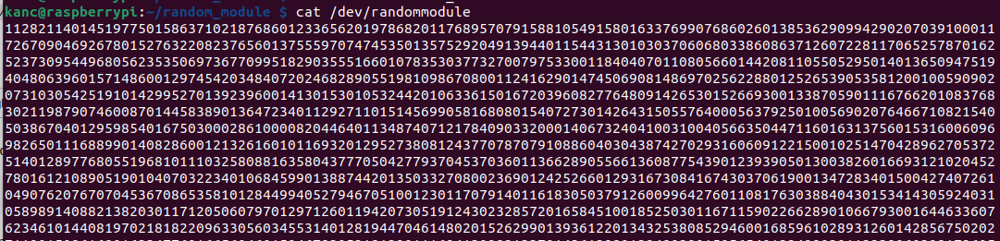

If we track the system message log, we can see the state of our new character device.

```bash
$ dmesg -w
```
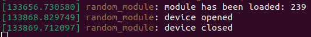

## Cross compile random_module

Using another machine, we will prepare the development environment and compile the `random_module.c` kernel module for the Raspberry Pi.
Source code is available in folder: [random_modulde-cc](random_module-cc)

Host machine is Ubuntu 22.04.4 LTS with AMD Ryzen CPU and 16GB RAM.

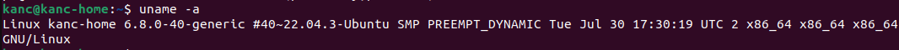

### Download kernel source

https://www.raspberrypi.com/documentation/computers/linux_kernel.html

``` bash
$ cd /media/kanc/20210324_4TB1/Software/raspberry_pi/
$ git clone --depth=1 https://github.com/raspberrypi/linux
```

### Install host machine dependencies

```bash
sudo apt install bc bison flex libssl-dev make libc6-dev libncurses5-dev
```

Since our device iz Rpi Zero W, which is 32bit, we will use 32bit toolchain

 - Device list and architecture is available at official raspberry pi site: https://www.raspberrypi.com/documentation/computers/linux_kernel.html#cross-compile-the-kernel

```bash
sudo apt install crossbuild-essential-armhf
```

### Prepare Make file

Point to the downloaded linux kernel dir

```c
CR_C := arm-linux-gnueabihf-
MODULES := /media/kanc/20210324_4TB1/Software/raspberry_pi/linux/
obj-m := random_module.o

all:
	make ARCH=arm CROSS_COMPILE=$(CR_C) -C $(MODULES) M=$(shell pwd) modules

clean:
	make ARCH=arm CROSS_COMPILE=$(CR_C) -C $(MODULES) M=$(shell pwd) clean
```

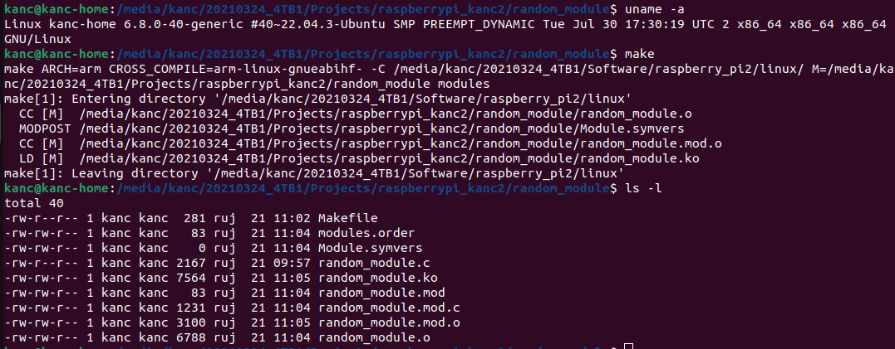

### Copy cross compiled module to Raspberry Pi

On your raspberry pi prepare folder:

```bash
mkdir /home/kanc/random_module-001; cd /home/kanc/random_module-001
kanc@raspberrypi:~/random_module-001
```

From host machine copy prepared kernel files:

```bash
scp random_module.ko kanc@192.168.53.121:/home/kanc/random_module-001/
```
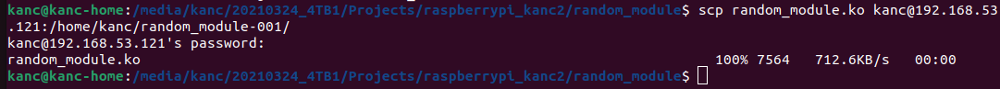


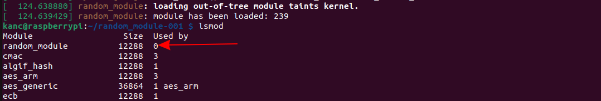

```bash
cat /dev/randommodule
```

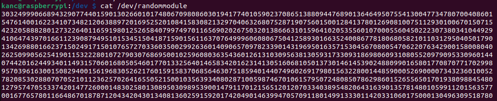


## Review

Process of creating kernel module is straight-forward when building on the same device.
When cross compiling, kernel version must be the same.
Instead of downloading old kernel version on my host machine i cross compiled latest kernel on my host machine and updated the kernel on the Raspberry Pi.
This process is also straigh-forward.
